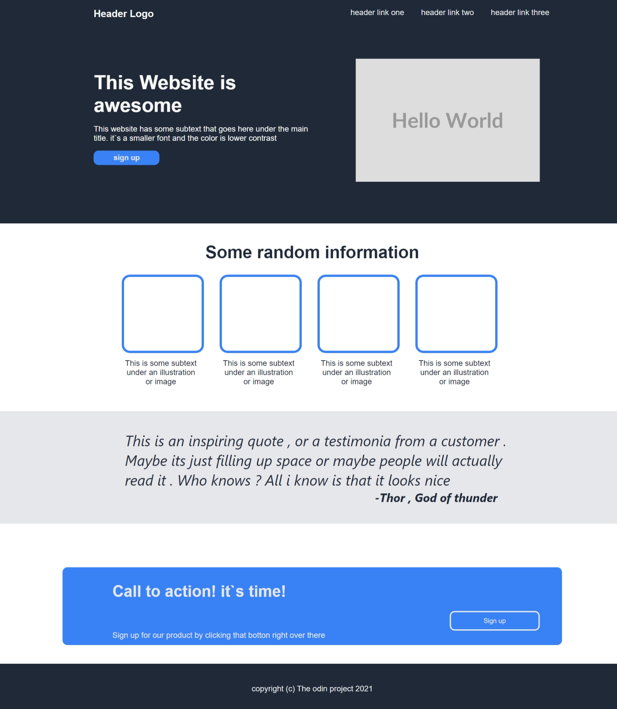

# Odin Landing Page

> This is a project about some semantic html elements and css elements.



Additional description of the project and its features.

## Built With

- Html elements,
  - `div`, `unordered list(ul)`, `button`
- CSS,
  - `display`, `width`, `height` `margin`, `padding`, `font-size`
  - `border-radius`, `color`, `background-color`, `font-style`
- Linters
  - [Prettier](https://prettier.io/)
  - [stylelint](https://stylelint.io/)

## Live Demo

[Live Demo Link](https://livedemo.com)

### Development (Running locally)

- Clone the project

```bash
git clone https://github.com/Gbemisola19/Odin-landing-page.git

```

- Install Dependencies

```bash
yarn install
```

To run StyleLint by itself, you may run the lint task:

```bash
yarn lint:check
```

Or to automatically fix issues found (where possible):

```bash
yarn lint
```

You can also check against Prettier:

```bash
yarn format:check
```

and to have it fix (to the best of its ability) any format issues, run:

```bash
yarn format
```

You can also check against HTML Validator (htmlhint):

```bash
yarn lint:html
```

To generate an accessibility report for this webpage, run the below command, it uses axe:

```bash
yarn axe
```

## Style Guides

- [CSS Style Guide](http://udacity.github.io/frontend-nanodegree-styleguide/css.html)
- [HTML Style Guide](http://udacity.github.io/frontend-nanodegree-styleguide/index.html)
- [JavaScript Style Guide](http://udacity.github.io/frontend-nanodegree-styleguide/javascript.html)
- [Git Style Guide](https://udacity.github.io/git-styleguide/)
- [AXE Accessibility Style Guide](https://dequeuniversity.com/rules/axe/html/4.7)

## 👤 Author

- Github: [@author](https://github.com/author)
- Twitter: [@author](https://twitter.com/author)
- Linkedin: [@author](https://www.linkedin.com/in/author/)

## 🤝 Contributing

Contributions, issues and feature requests are welcome!

Feel free to check the [issues page](../../issues).

## Show your support

Give a ⭐️ if you like this project!

## Acknowledgments

- https://www.theodinproject.com/lessons/foundations-landing-page

## 📝 License

[MIT licensed](./LICENSE).
